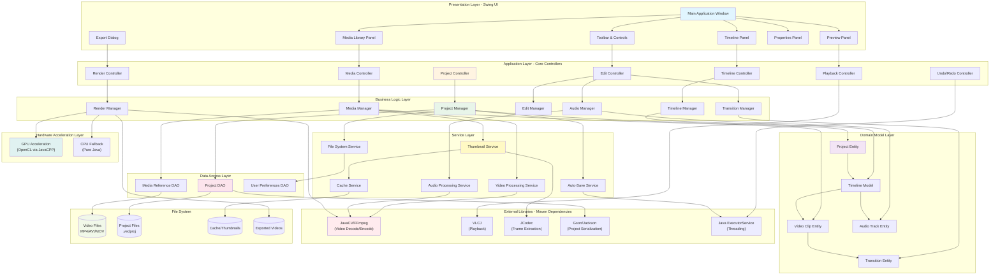

  

```mermaid
graph TB
    subgraph "Presentation Layer - Swing UI"
        UI[Main Application Window]
        ML[Media Library Panel]
        TL[Timeline Panel]
        PV[Preview Panel]
        TB[Toolbar & Controls]
        PM[Properties Panel]
        EP[Export Dialog]
        
        UI --> ML
        UI --> TL
        UI --> PV
        UI --> TB
        UI --> PM
    end
    
    subgraph "Application Layer - Core Controllers"
        PC[Project Controller]
        MC[Media Controller]
        TC[Timeline Controller]
        PC_CTRL[Playback Controller]
        EC[Edit Controller]
        RC[Render Controller]
        URC[Undo/Redo Controller]
        
        ML --> MC
        TL --> TC
        PV --> PC_CTRL
        TB --> EC
        EP --> RC
    end
    
    subgraph "Business Logic Layer"
        PM_MGR[Project Manager]
        MM[Media Manager]
        TM[Timeline Manager]
        EM[Edit Manager]
        TRM[Transition Manager]
        AM[Audio Manager]
        RM[Render Manager]
        
        PC --> PM_MGR
        MC --> MM
        TC --> TM
        EC --> EM
        EC --> TRM
        EC --> AM
        RC --> RM
    end
    
    subgraph "Domain Model Layer"
        PROJECT[Project Entity]
        CLIP[Video Clip Entity]
        AUDIO[Audio Track Entity]
        TRANS[Transition Entity]
        TIMELINE_MODEL[Timeline Model]
        
        PM_MGR --> PROJECT
        MM --> CLIP
        TM --> TIMELINE_MODEL
        TRM --> TRANS
        AM --> AUDIO
        
        PROJECT --> TIMELINE_MODEL
        TIMELINE_MODEL --> CLIP
        TIMELINE_MODEL --> AUDIO
        CLIP --> TRANS
    end
    
    subgraph "Service Layer"
        TS[Thumbnail Service]
        VS[Video Processing Service]
        AS[Audio Processing Service]
        FS[File System Service]
        CACHE[Cache Service]
        AUTO[Auto-Save Service]
        
        MM --> TS
        MM --> VS
        AM --> AS
        PM_MGR --> FS
        PM_MGR --> AUTO
        TS --> CACHE
    end
    
    subgraph "Data Access Layer"
        PRJ_DAO[Project DAO]
        MEDIA_DAO[Media Reference DAO]
        PREF_DAO[User Preferences DAO]
        
        PM_MGR --> PRJ_DAO
        MM --> MEDIA_DAO
        FS --> PREF_DAO
    end
    
    subgraph "External Libraries - Maven Dependencies"
        JAVACV["JavaCV/FFmpeg<br/>(Video Decode/Encode)"]
        VLCJ["VLCJ<br/>(Playback)"]
        JCODEC["JCodec<br/>(Frame Extraction)"]
        JSON["Gson/Jackson<br/>(Project Serialization)"]
        EXECUTOR["Java ExecutorService<br/>(Threading)"]
    end
    
    subgraph "Hardware Acceleration Layer"
        GPU["GPU Acceleration<br/>(OpenCL via JavaCPP)"]
        CPU["CPU Fallback<br/>(Pure Java)"]
        
        RM --> GPU
        RM --> CPU
    end
    
    subgraph "File System"
        VIDEO_FILES[(Video Files<br/>MP4/AVI/MOV)]
        PROJECT_FILES[(Project Files<br/>.vedproj)]
        CACHE_FILES[(Cache/Thumbnails)]
        EXPORT_FILES[(Exported Videos)]
    end
    
    VS --> JAVACV
    AS --> JAVACV
    PC_CTRL --> VLCJ
    TS --> JCODEC
    RM --> JAVACV
    PRJ_DAO --> JSON
    URC --> EXECUTOR
    AUTO --> EXECUTOR
    
    MEDIA_DAO --> VIDEO_FILES
    PRJ_DAO --> PROJECT_FILES
    CACHE --> CACHE_FILES
    RM --> EXPORT_FILES
    
    style UI fill:#e1f5ff
    style PC fill:#fff4e1
    style PM_MGR fill:#e8f5e9
    style PROJECT fill:#f3e5f5
    style TS fill:#fff9c4
    style PRJ_DAO fill:#fce4ec
    style JAVACV fill:#ffebee
    style GPU fill:#e0f2f1
    style VIDEO_FILES fill:#f1f8e9
```
